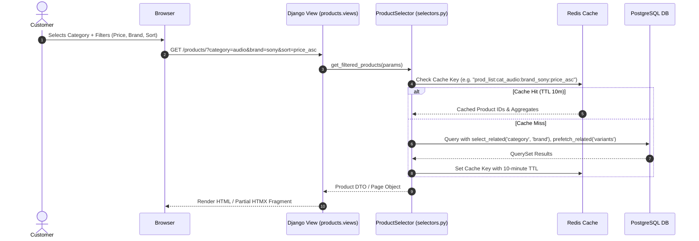
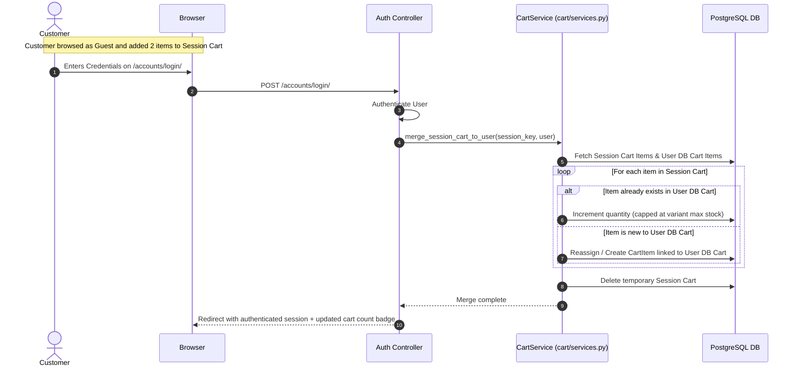
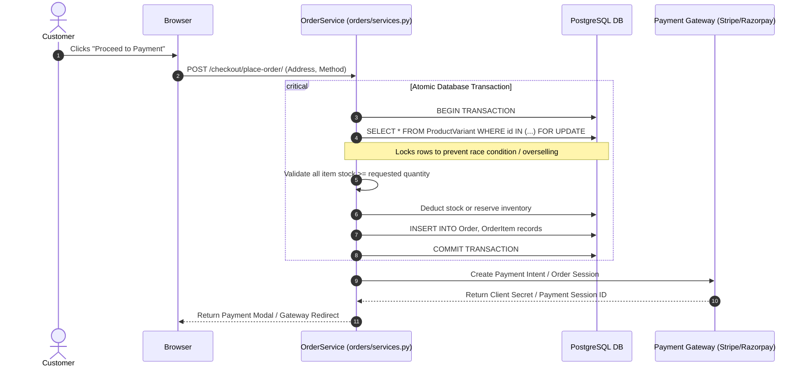
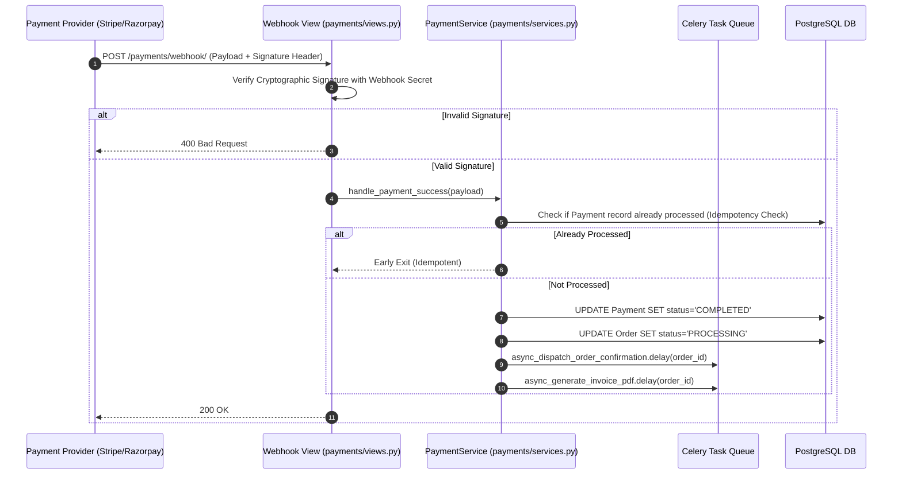

# System Architecture & Technical Flow

## Project: Next-Generation Modern E-Commerce Platform

---

## 1. High-Level Architectural Pattern

The application follows a **Modular Monolith** architecture pattern with a **Domain-Driven Service Layer**. This combines the rapid development and transactional integrity of Django with clear boundaries between domain apps, high-throughput caching, and decoupled asynchronous background workers.

```
+-------------------------------------------------------------------------------+
|                                CLIENT TIER                                    |
|       Desktop / Mobile Web Browsers  •  PWA  •  REST/JSON AJAX Clients         |
+---------------------------------------+---------------------------------------+
                                        | HTTPS / TLS 1.3
                                        v
+-------------------------------------------------------------------------------+
|                             EDGE & REVERSE PROXY                              |
|           Cloudflare / AWS CloudFront (CDN, SSL, WAF, Static Caching)          |
|                     Nginx Reverse Proxy & WhiteNoise Engine                   |
+---------------------------------------+---------------------------------------+
                                        | WSGI / ASGI (Gunicorn / Uvicorn)
                                        v
+-------------------------------------------------------------------------------+
|                            DJANGO CORE APPLICATION                            |
|                                                                               |
|  +-------------------------------------------------------------------------+  |
|  | Middleware: Security, RateLimit, Session, Authentication, CSRF, Cache   |  |
|  +-------------------------------------------------------------------------+  |
|  | URL Dispatcher & View Layer (Class-Based & Functional Views + JSON)     |  |
|  +-------------------------------------------------------------------------+  |
|  | Service Layer (Business Logic: OrderService, PaymentService, CartMerge) |  |
|  +-------------------------------------------------------------------------+  |
|  | Selectors & Queries (Optimized ORM Queries, select_related, prefetch)   |  |
|  +-------------------------------------------------------------------------+  |
|  | Models & Signals Layer (Data Definitions, State Validation, Auditing)   |  |
|  +-------------------------------------------------------------------------+  |
|                                                                               |
+------------------+--------------------+--------------------+------------------+
                   |                    |                    |
                   v                    v                    v
          +-----------------+  +-----------------+  +-----------------+
          |    DATABASE     |  |  CACHE & BROKER |  |  ASYNC WORKERS  |
          |  PostgreSQL 16  |  |   Redis 7.x     |  |  Celery Workers |
          |  (ACID Storage) |  | (Session/Cache) |  |  & Celery Beat  |
          +-----------------+  +-----------------+  +-----------------+
                   |                    |                    |
                   |                    |                    v
                   |                    |          +-------------------+
                   |                    |          | Transactional SMS |
                   |                    |          | & Emails (SMTP)   |
                   |                    |          +-------------------+
                   |                    |          | PDF Invoices      |
                   |                    |          | (ReportLab)       |
                   |                    |          +-------------------+
                   v                    v
          +-----------------------------------------------------------+
          |                    EXTERNAL SERVICES                      |
          |  - Payment Gateways: Stripe API & Razorpay API            |
          |  - Cloud Storage: AWS S3 / Cloudinary (Product Media)     |
          +-----------------------------------------------------------+
```

---

## 2. Django Apps & Modular Directory Structure

The platform is partitioned into 20 modular domain applications under `apps/`, accompanied by `core` for shared utilities:

```
d:\django_project\E-Commerce\E-Commerce\
│
├── ecom/                                  # Project Root
│   ├── manage.py
│   ├── ecom/                              # Core Configuration Package
│   │   ├── __init__.py
│   │   ├── asgi.py
│   │   ├── wsgi.py
│   │   ├── settings.py                    # Settings (with modular env configuration)
│   │   └── urls.py                        # Root URL configuration (routes to apps.cms.urls)
│   │
│   ├── apps/                              # 20 Modular Domain Applications
│   │   ├── accounts/                      # Users, profiles, addresses, roles
│   │   ├── catalog/                       # Products, categories, brands, attributes, variants
│   │   ├── inventory/                     # Stock, warehouses, stock movements
│   │   ├── search/                        # Search queries, filters, search results
│   │   ├── cart/                          # Carts, cart items, abandoned carts
│   │   ├── wishlist/                      # Wishlists, wishlist items
│   │   ├── checkout/                      # Checkout sessions, addresses, shipping selections
│   │   ├── payments/                      # Transactions, payment methods, refunds
│   │   ├── orders/                        # Orders, order items, order status, order history
│   │   ├── shipping/                      # Shipments, carriers, tracking, shipping zones
│   │   ├── fulfillment/                   # Picking, packing, fulfillment tasks
│   │   ├── promotions/                    # Coupons, discounts, campaigns
│   │   ├── reviews/                       # Reviews, ratings, moderation
│   │   ├── notifications/                 # Email, SMS, push notifications, templates
│   │   ├── recommendations/               # Product recommendations, recommendation rules
│   │   ├── cms/                           # Pages, banners, menus, content blocks (serves homepage)
│   │   ├── analytics/                     # Sales, customers, products, conversion metrics
│   │   ├── support/                       # Tickets, customer queries, complaints
│   │   ├── audit/                         # Admin actions, login activity, system events
│   │   ├── settings/                      # Store settings, payment settings, shipping settings
│   │   └── core/                          # Base abstract models, common mixins, custom validators
│   │
│   ├── static/                            # Global Static Assets
│   │   ├── css/                           # Global stylesheets & design tokens
│   │   ├── js/                            # Global scripts, Alpine components, HTMX
│   │   ├── src/                           # Tailwind CSS source (input.css, output.css)
│   │   └── images/                        # Branding, logos, favicons
│   │
│   ├── media/                             # User & product media uploads (local dev)
│   │
│   └── templates/                         # Domain & Presentation Templates
│       ├── base.html                      # Master HTML5 layout skeleton
│       ├── components/                    # Reusable UI partials (header, footer, drawer, toast)
│       ├── accounts/                      # login.html, register.html, profile.html, users.html, user_detail.html
│       ├── catalog/                       # products.html, product_detail.html, categories.html, brands.html, variants.html
│       ├── inventory/                     # inventory.html, stock_detail.html, warehouses.html, stock_movements.html
│       ├── search/                        # search.html, search_results.html, search_analytics.html
│       ├── cart/                          # cart.html, cart_detail.html, abandoned_carts.html
│       ├── wishlist/                      # wishlist.html, wishlist_detail.html
│       ├── checkout/                      # checkout.html, address.html, shipping.html, review.html
│       ├── payments/                      # payments.html, transaction_detail.html, refunds.html
│       ├── orders/                        # orders.html, order_detail.html, order_invoice.html
│       ├── shipping/                      # shipments.html, shipment_detail.html, tracking.html, carriers.html
│       ├── fulfillment/                   # fulfillment.html, picking.html, packing.html, tasks.html
│       ├── promotions/                    # promotions.html, coupons.html, campaigns.html, promotion_detail.html
│       ├── reviews/                       # reviews.html, review_detail.html, moderation.html
│       ├── notifications/                 # notifications.html, templates.html, notification_detail.html
│       ├── recommendations/               # recommendations.html, rules.html, recommendation_analytics.html
│       ├── cms/                           # pages.html, page_editor.html, banners.html, menus.html
│       ├── analytics/                     # dashboard.html, sales.html, customers.html, products.html, reports.html
│       ├── support/                       # tickets.html, ticket_detail.html, customers.html, knowledge_base.html
│       ├── audit/                         # logs.html, activity_detail.html, security_events.html
│       └── settings/                      # settings.html, general.html, payment.html, shipping.html, email.html
│
├── prd.md                                 # Product Requirements Document
├── architecture.md                        # System Architecture & Technical Flow
├── rules.md                               # Coding Standards, Stack & Library Directives
├── phases.md                              # Milestone & Phase-wise Creation Plan
├── design.md                              # Design System, Palette & Typography
└── memory.md                              # Project Status & Current Working File Index
```

### 2.1. Master Application & Domain Architecture Matrix

| App Name | Contains Data Of | Dashboard Shows | Templates |
| :--- | :--- | :--- | :--- |
| `accounts` | Users, profiles, addresses, roles | Total users, active users, new users, blocked users | `login`, `register`, `profile`, `users`, `user_detail` |
| `catalog` | Products, categories, brands, attributes, variants | Total products, categories, active products, out-of-stock products | `products`, `product_detail`, `categories`, `brands`, `variants` |
| `inventory` | Stock, warehouses, stock movements | Total stock, low stock, out of stock, reserved stock | `inventory`, `stock_detail`, `warehouses`, `stock_movements` |
| `search` | Search queries, filters, search results | Popular searches, zero-result searches, search trends | `search`, `search_results`, `search_analytics` |
| `cart` | Carts, cart items, abandoned carts | Active carts, abandoned carts, cart value, cart conversion | `cart`, `cart_detail`, `abandoned_carts` |
| `wishlist` | Wishlists, wishlist items | Total wishlists, popular products, wishlist conversions | `wishlist`, `wishlist_detail` |
| `checkout` | Checkout sessions, addresses, shipping selections | Active checkouts, completed checkouts, abandoned checkouts | `checkout`, `address`, `shipping`, `review` |
| `payments` | Transactions, payment methods, refunds | Successful payments, failed payments, pending payments, refunds | `payments`, `transaction_detail`, `refunds` |
| `orders` | Orders, order items, order status, order history | Total orders, pending, processing, shipped, delivered, cancelled | `orders`, `order_detail`, `order_invoice` |
| `shipping` | Shipments, carriers, tracking, shipping zones | Pending shipments, shipped, in-transit, delivered, delayed | `shipments`, `shipment_detail`, `tracking`, `carriers` |
| `fulfillment` | Picking, packing, fulfillment tasks | Pending fulfillment, picking, packing, ready to ship | `fulfillment`, `picking`, `packing`, `tasks` |
| `promotions` | Coupons, discounts, campaigns | Active offers, coupon usage, discount amount, campaign revenue | `promotions`, `coupons`, `campaigns`, `promotion_detail` |
| `reviews` | Reviews, ratings, moderation | Total reviews, average rating, pending/reported reviews | `reviews`, `review_detail`, `moderation` |
| `notifications` | Email, SMS, push notifications, templates | Sent, delivered, failed, opened notifications | `notifications`, `templates`, `notification_detail` |
| `recommendations` | Product recommendations, recommendation rules | Recommendation clicks, CTR, attributed revenue | `recommendations`, `rules`, `recommendation_analytics` |
| `cms` | Pages, banners, menus, content blocks | Published pages, banners, drafts, scheduled content | `pages`, `page_editor`, `banners`, `menus` |
| `analytics` | Sales, customers, products, conversion metrics | Revenue, sales, conversion, AOV, customer analytics | `dashboard`, `sales`, `customers`, `products`, `reports` |
| `support` | Tickets, customer queries, complaints | Open tickets, pending, resolved, response time | `tickets`, `ticket_detail`, `customers`, `knowledge_base` |
| `audit` | Admin actions, login activity, system events | Recent activities, security events, admin actions | `logs`, `activity_detail`, `security_events` |
| `settings` | Store settings, payment settings, shipping settings | Store configuration status | `settings`, `general`, `payment`, `shipping`, `email` |

---

## 3. Database Architecture & Entity Relationship (ERD)

```mermaid
erDiagram
    User ||--o{ Address : "has multiple"
    User ||--o{ Order : "places"
    User ||--o| Cart : "owns active"
    User ||--o{ Review : "writes"
    User ||--o{ Wishlist : "saves"

    Category ||--o{ Category : "has subcategories"
    Category ||--o{ Product : "categorizes"
    Brand ||--o{ Product : "manufactures"
    
    Product ||--o{ ProductVariant : "has variants"
    Product ||--o{ ProductImage : "contains images"
    Product ||--o{ Review : "receives"
    Product ||--o{ Wishlist : "saved in"

    Cart ||--o{ CartItem : "contains"
    ProductVariant ||--o{ CartItem : "referenced by"

    Order ||--o{ OrderItem : "composed of"
    ProductVariant ||--o{ OrderItem : "snapshot captured in"
    Order ||--o| Payment : "settled via"
    Coupon ||--o{ Order : "discount applied"

    User {
        uuid id PK
        string email UK
        string full_name
        string role
        boolean is_verified
        datetime created_at
    }

    Product {
        uuid id PK
        string title
        string slug UK
        text description
        decimal base_price
        boolean is_active
        datetime created_at
    }

    ProductVariant {
        uuid id PK
        fk product_id
        string sku UK
        string variant_name
        decimal price_override
        int stock_quantity
        jsonb attributes
    }

    Cart {
        uuid id PK
        fk user_id NULL
        string session_key NULL
        datetime updated_at
    }

    CartItem {
        uuid id PK
        fk cart_id
        fk variant_id
        int quantity
    }

    Order {
        uuid id PK
        string order_number UK
        fk user_id
        fk shipping_address_id
        string status
        decimal subtotal
        decimal discount_amount
        decimal tax_amount
        decimal shipping_fee
        decimal grand_total
        datetime created_at
    }

    OrderItem {
        uuid id PK
        fk order_id
        fk variant_id
        string product_title_snapshot
        string sku_snapshot
        decimal unit_price_snapshot
        int quantity
        decimal total_price
    }

    Payment {
        uuid id PK
        fk order_id UK
        string gateway
        string transaction_id UK
        decimal amount
        string status
        jsonb raw_response
        datetime settled_at
    }
```

---

## 4. End-to-End Application Flows

### 4.1. Faceted Product Discovery & Search Flow


---

### 4.2. Dual Cart Synchronization Flow (Guest to User Login)


---

### 4.3. Checkout Concurrency & Atomic Order Creation


---

### 4.4. Payment Webhook Verification & Async Fulfillment


---

## 5. Order State Machine Transitions

```
               [Customer Places Order]
                          |
                          v
                 +-----------------+
                 | PENDING_PAYMENT |
                 +-----------------+
                    /           \
     (Payment Success)         (Payment Failed / Timeout)
                  /               \
                 v                 v
        +------------+      +------------+
        | PROCESSING |      | CANCELLED  |  --> (Restock Inventory)
        +------------+      +------------+
               |
        (Warehouse Ships)
               |
               v
        +------------+
        |  SHIPPED   |
        +------------+
               |
       (Carrier Delivers)
               |
               v
        +------------+
        | DELIVERED  |
        +------------+
          /          \
  (No issues)      (Return Requested & Approved)
        /              \
       v                v
  [COMPLETED]       +------------+
                    |  REFUNDED  |  --> (Trigger Gateway Refund)
                    +------------+
```

---

## 6. Background Jobs & Caching Architecture

| Worker / Cache Task | Technology | Trigger / Schedule | Purpose |
| :--- | :--- | :--- | :--- |
| **Catalog Page Caching** | Redis Cache Backend | Read with TTL (10m) / Invalidated on model save | Sub-50ms catalog responses |
| **Session Store** | Redis Cache Backend | HTTP Request / Response | High-speed ephemeral sessions |
| **Email Notifications** | Celery Worker | Async event on order/account triggers | Prevents web server blocking on SMTP |
| **PDF Invoice Generator** | Celery Worker | Async event on payment success | Renders and stores invoices without delaying checkout |
| **Abandoned Cart Cleanup** | Celery Beat | Scheduled nightly (02:00 UTC) | Purges expired guest carts and stale reservations |
| **Stock Alert Trigger** | Celery Worker | When inventory <= threshold | Alerts admin to restock low-inventory items |

---

## 7. Enterprise Superadmin Management Suite Architecture

The administrative layer is decoupled from customer storefront views and provides comprehensive visibility and governance across all 20 domain microservices.

### 7.1. Route & View Map

| Endpoint | View Function | Security Guard | Template | Role / Capabilities |
| :--- | :--- | :--- | :--- | :--- |
| `/management/` | `management_page_view` | Public / Departmental | `management/portal.html` | Public domain overview with individual staff login modals |
| `/management/login/` | `superadmin_login_view` | Unauthenticated | `management/superadmin_login.html` | Root administrator authentication gate |
| `/management/logout/` | `superadmin_logout_view` | Authenticated | N/A (Redirect) | Terminate active administrative session |
| `/management/dashboard/` | `superadmin_dashboard_view` | `is_superuser=True` | `management/superadmin_dashboard.html` | Executive KPIs, order breakdown donut, 12M sales/views dual bar, and security stream |
| `/management/sales/` | `superadmin_sales_view` | `is_superuser=True` | `management/superadmin_sales.html` | 6 financial KPIs, SVG 30-day revenue curve, gateway distribution, and paginated ledger |
| `/management/analytics/`| `superadmin_analytics_view`| `is_superuser=True` | `management/superadmin_analytics.html`| Storefront views, conversion funnel, revenue split donut, and regional traffic |
| `/management/domains/` | `superadmin_domains_view` | `is_superuser=True` | `management/superadmin_domains.html` | 20-app infrastructure matrix, phase badges, category filtering, and direct admin DB links |
| `/management/users/` | `superadmin_users_view` | `is_superuser=True` | `management/superadmin_users.html` | Account directory, role badges, active states, and permission controls |

### 7.2. Centralized Base Architecture (`superadmin_base.html`)
- **Executive Layout Structure:** Left sidebar + Top navigation header + Scrollable `<main>` viewport.
- **Collapsible Mini-Rail Mode:**
  - Desktop: Collapses from 16rem to 5rem mini-rail, hiding labels and centering icons.
  - Mobile: Drawer overlay with backdrop blur.
  - State Persistence: Synchronized with `localStorage` and restored immediately before initial render via synchronous script.
- **Quick Command Palette (`Ctrl+K`):** Instant modal search and routing to any management screen or Django DB admin table.
- **Zero-Network Dependency Engine:**
  - Tailwind CSS compiled offline to `static/src/output.css` and `static/css/output.css`.
  - Lucide icons loaded locally via `static/js/lucide.min.js`.

### 7.3. Client-Side Table Engine & Print Pipeline (`table-paginator.js`)
- **`TablePaginator` Class:** Provides zero-dependency pagination, search filtering, category filtering, and rows-per-page selection across all tabular views.
- **Native Print Pipeline:** Intercepts `window.beforeprint` and `window.afterprint` to un-paginate the table into a clean multi-page document with repeating headers and print metadata, while hiding UI chrome via `@media print`.
