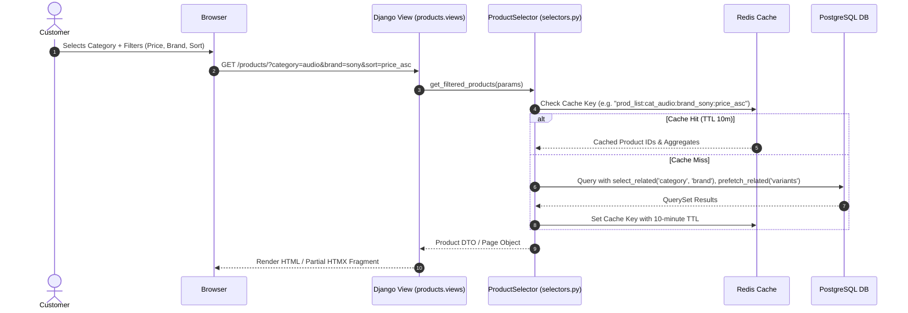
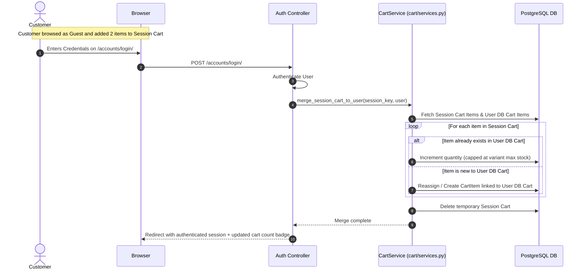
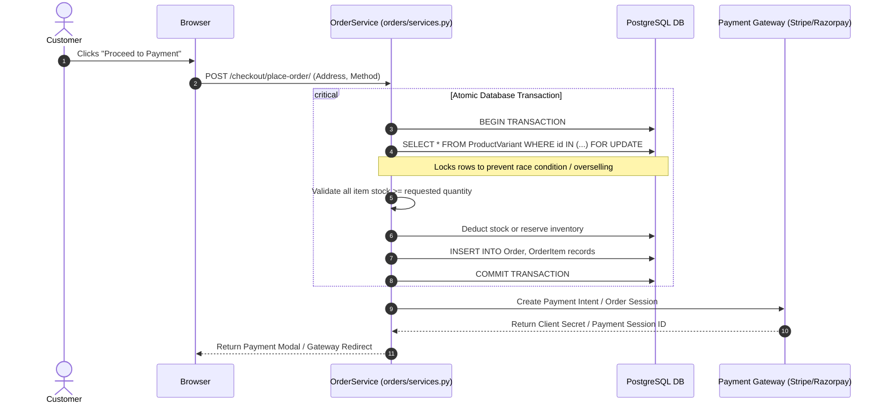
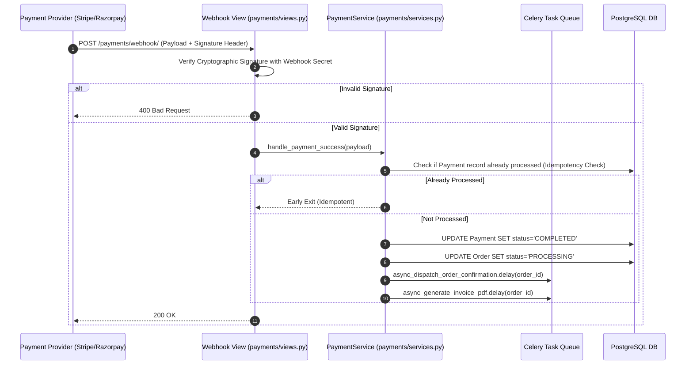

# System Architecture & Technical Flow

## Project: Next-Generation Modern E-Commerce Platform

---

## 1. High-Level Architectural Pattern

The application follows a **Modular Monolith** architecture pattern with a **Domain-Driven Service Layer**. This combines the rapid development and transactional integrity of Django with clear boundaries between domain apps, high-throughput caching, and decoupled asynchronous background workers.

```
+-------------------------------------------------------------------------------+
|                                CLIENT TIER                                    |
|       Desktop / Mobile Web Browsers  •  PWA  •  REST/JSON AJAX Clients         |
+---------------------------------------+---------------------------------------+
                                        | HTTPS / TLS 1.3
                                        v
+-------------------------------------------------------------------------------+
|                             EDGE & REVERSE PROXY                              |
|           Cloudflare / AWS CloudFront (CDN, SSL, WAF, Static Caching)          |
|                     Nginx Reverse Proxy & WhiteNoise Engine                   |
+---------------------------------------+---------------------------------------+
                                        | WSGI / ASGI (Gunicorn / Uvicorn)
                                        v
+-------------------------------------------------------------------------------+
|                            DJANGO CORE APPLICATION                            |
|                                                                               |
|  +-------------------------------------------------------------------------+  |
|  | Middleware: Security, RateLimit, Session, Authentication, CSRF, Cache   |  |
|  +-------------------------------------------------------------------------+  |
|  | URL Dispatcher & View Layer (Class-Based & Functional Views + JSON)     |  |
|  +-------------------------------------------------------------------------+  |
|  | Service Layer (Business Logic: OrderService, PaymentService, CartMerge) |  |
|  +-------------------------------------------------------------------------+  |
|  | Selectors & Queries (Optimized ORM Queries, select_related, prefetch)   |  |
|  +-------------------------------------------------------------------------+  |
|  | Models & Signals Layer (Data Definitions, State Validation, Auditing)   |  |
|  +-------------------------------------------------------------------------+  |
|                                                                               |
+------------------+--------------------+--------------------+------------------+
                   |                    |                    |
                   v                    v                    v
          +-----------------+  +-----------------+  +-----------------+
          |    DATABASE     |  |  CACHE & BROKER |  |  ASYNC WORKERS  |
          |  PostgreSQL 16  |  |   Redis 7.x     |  |  Celery Workers |
          |  (ACID Storage) |  | (Session/Cache) |  |  & Celery Beat  |
          +-----------------+  +-----------------+  +-----------------+
                   |                    |                    |
                   |                    |                    v
                   |                    |          +-------------------+
                   |                    |          | Transactional SMS |
                   |                    |          | & Emails (SMTP)   |
                   |                    |          +-------------------+
                   |                    |          | PDF Invoices      |
                   |                    |          | (ReportLab)       |
                   |                    |          +-------------------+
                   v                    v
          +-----------------------------------------------------------+
          |                    EXTERNAL SERVICES                      |
          |  - Payment Gateways: Stripe API & Razorpay API            |
          |  - Cloud Storage: AWS S3 / Cloudinary (Product Media)     |
          +-----------------------------------------------------------+
```

---

## 2. Django Apps & Modular Directory Structure

```
d:\django_project\E-Commerce\E-Commerce\
│
├── ecom/                          # Project Root
│   ├── manage.py
│   ├── ecom/                      # Core Configuration Package
│   │   ├── __init__.py
│   │   ├── asgi.py
│   │   ├── wsgi.py
│   │   ├── settings/
│   │   │   ├── __init__.py
│   │   │   ├── base.py            # Shared settings, installed apps, middleware
│   │   │   ├── development.py     # Local debug settings
│   │   │   └── production.py      # Hardened security, S3, Redis settings
│   │   └── urls.py                # Root URL configuration
│   │
│   ├── apps/                      # Dedicated Domain Apps
│   │   ├── core/                  # Base models, custom mixins, global templatetags
│   │   ├── accounts/              # Custom User, Address, Profiles, Auth
│   │   ├── products/              # Categories, Brands, Products, Variants, Inventory
│   │   ├── cart/                  # Session Cart, Database Cart, Cart Sync
│   │   ├── orders/                # Orders, OrderItems, Tracking, State Machine
│   │   ├── payments/              # Gateways (Stripe/Razorpay), Webhook listeners
│   │   ├── promotions/            # Coupons, Discounts, Banner announcements
│   │   ├── reviews/               # Verified buyer reviews, ratings
│   │   └── dashboard/             # Customer Portal & Admin/Vendor views
│   │
│   ├── static/                    # CSS, JS, Branding Assets
│   │   ├── css/                   # Design token styles & vanilla styling
│   │   ├── js/                    # Cart drawers, Alpine/HTMX scripts
│   │   └── img/                   # Logos, fallbacks, placeholders
│   ├── media/                     # User uploads (local dev)
│   └── templates/                 # Global UI Templates
│       ├── base.html              # Master layout
│       ├── components/            # Reusable header, footer, cards, modals, toasts
│       ├── accounts/
│       ├── products/
│       ├── cart/
│       ├── checkout/
│       └── orders/
│
├── prd.md                         # Product Requirements Document
├── architecture.md                # System Architecture & Technical Flow
├── rules.md                       # Coding Standards, Stack & Library Directives
├── phases.md                      # Milestone & Phase-wise Creation Plan
├── design.md                      # Design System, Palette & Typography
└── memory.md                      # Project Status & Current Working File Index
```

---

## 3. Database Architecture & Entity Relationship (ERD)

```mermaid
erDiagram
    User ||--o{ Address : "has multiple"
    User ||--o{ Order : "places"
    User ||--o| Cart : "owns active"
    User ||--o{ Review : "writes"
    User ||--o{ Wishlist : "saves"

    Category ||--o{ Category : "has subcategories"
    Category ||--o{ Product : "categorizes"
    Brand ||--o{ Product : "manufactures"
    
    Product ||--o{ ProductVariant : "has variants"
    Product ||--o{ ProductImage : "contains images"
    Product ||--o{ Review : "receives"
    Product ||--o{ Wishlist : "saved in"

    Cart ||--o{ CartItem : "contains"
    ProductVariant ||--o{ CartItem : "referenced by"

    Order ||--o{ OrderItem : "composed of"
    ProductVariant ||--o{ OrderItem : "snapshot captured in"
    Order ||--o| Payment : "settled via"
    Coupon ||--o{ Order : "discount applied"

    User {
        uuid id PK
        string email UK
        string full_name
        string role
        boolean is_verified
        datetime created_at
    }

    Product {
        uuid id PK
        string title
        string slug UK
        text description
        decimal base_price
        boolean is_active
        datetime created_at
    }

    ProductVariant {
        uuid id PK
        fk product_id
        string sku UK
        string variant_name
        decimal price_override
        int stock_quantity
        jsonb attributes
    }

    Cart {
        uuid id PK
        fk user_id NULL
        string session_key NULL
        datetime updated_at
    }

    CartItem {
        uuid id PK
        fk cart_id
        fk variant_id
        int quantity
    }

    Order {
        uuid id PK
        string order_number UK
        fk user_id
        fk shipping_address_id
        string status
        decimal subtotal
        decimal discount_amount
        decimal tax_amount
        decimal shipping_fee
        decimal grand_total
        datetime created_at
    }

    OrderItem {
        uuid id PK
        fk order_id
        fk variant_id
        string product_title_snapshot
        string sku_snapshot
        decimal unit_price_snapshot
        int quantity
        decimal total_price
    }

    Payment {
        uuid id PK
        fk order_id UK
        string gateway
        string transaction_id UK
        decimal amount
        string status
        jsonb raw_response
        datetime settled_at
    }
```

---

## 4. End-to-End Application Flows

### 4.1. Faceted Product Discovery & Search Flow


---

### 4.2. Dual Cart Synchronization Flow (Guest to User Login)


---

### 4.3. Checkout Concurrency & Atomic Order Creation


---

### 4.4. Payment Webhook Verification & Async Fulfillment


---

## 5. Order State Machine Transitions

```
               [Customer Places Order]
                          |
                          v
                 +-----------------+
                 | PENDING_PAYMENT |
                 +-----------------+
                    /           \
     (Payment Success)         (Payment Failed / Timeout)
                  /               \
                 v                 v
        +------------+      +------------+
        | PROCESSING |      | CANCELLED  |  --> (Restock Inventory)
        +------------+      +------------+
               |
        (Warehouse Ships)
               |
               v
        +------------+
        |  SHIPPED   |
        +------------+
               |
       (Carrier Delivers)
               |
               v
        +------------+
        | DELIVERED  |
        +------------+
          /          \
  (No issues)      (Return Requested & Approved)
        /              \
       v                v
  [COMPLETED]       +------------+
                    |  REFUNDED  |  --> (Trigger Gateway Refund)
                    +------------+
```

---

## 6. Background Jobs & Caching Architecture

| Worker / Cache Task | Technology | Trigger / Schedule | Purpose |
| :--- | :--- | :--- | :--- |
| **Catalog Page Caching** | Redis Cache Backend | Read with TTL (10m) / Invalidated on model save | Sub-50ms catalog responses |
| **Session Store** | Redis Cache Backend | HTTP Request / Response | High-speed ephemeral sessions |
| **Email Notifications** | Celery Worker | Async event on order/account triggers | Prevents web server blocking on SMTP |
| **PDF Invoice Generator** | Celery Worker | Async event on payment success | Renders and stores invoices without delaying checkout |
| **Abandoned Cart Cleanup** | Celery Beat | Scheduled nightly (02:00 UTC) | Purges expired guest carts and stale reservations |
| **Stock Alert Trigger** | Celery Worker | When inventory <= threshold | Alerts admin to restock low-inventory items |
